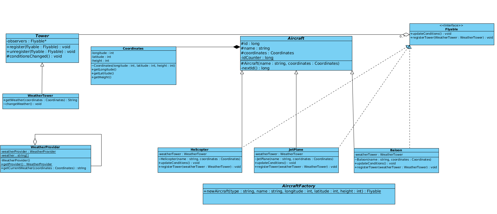

# Avaj-Launcher
A minimal aircraft simulation program based on a given UML class diagram. 

## Compile
To compile in cmd  
* Run:  
   + -> javac simulator/Simulator.java  
   + -> java simulator.Simulator Test.txt  

From the src directory   

## References

### [Oracle's Java SE 7 Documentation](https://docs.oracle.com/javase/7/docs/api/)  
e.g. https://docs.oracle.com/javase/7/docs/api/java/io/BufferedReader.html

### [Oracle's Java SE 7 Tutorials](https://docs.oracle.com/javase/tutorial/essential/)  
e.g. https://docs.oracle.com/javase/tutorial/essential/exceptions/finally.html

### [A pretty good programming resource](http://www.java2s.com/)
e.g. http://www.java2s.com/Code/JavaAPI/java.io/BufferedInputStream.htm

### Links  
*   https://docs.oracle.com/javase/7/docs/api/java/io/BufferedReader.html  
*   https://docs.oracle.com/javase/tutorial/essential/exceptions/finally.html  
*   http://www.java2s.com/Code/JavaAPI/java.util/foreachloopforArrayList.htm  

## V.1 Program behaviour

Your program will take one and only one argument from the command line. This argument
represents the name of a text file that will contain the scenario that needs to be
simulated. You can find an example file provided with the subject.
Executing the program will generate a file simulation.txt that describes the outcome
of the simulation.

### Example:
$java ro.academyplus.avaj.simulator.Simulator scenario.txt  
$cat -e simulation.txt  
Tower says: Baloon#B1(1) registered to weather tower.  
Tower says: JetPlane#J1(2) registered to weather tower.  
Tower says: Helicopter#H1(3) registered to weather tower.  
Tower says: Helicopter#H4(4) registered to weather tower.  
Baloon#B1(1): Let's enjoy the good weather and take some pics.  
JetPlane#J1(2): It's raining. Better watch out for lightings.  
Helicopter#H1(3): This is hot.  
Helicopter#H4(4): My rotor is going to freeze!  
Baloon#B1(1): Damn you rain! You messed up my baloon.  
JetPlane#J1(2): OMG! Winter is coming!  
Helicopter#H1(3): This is hot.  
Helicopter#H4(4): My rotor is going to freeze!  
Baloon#B1(1): It's snowing. We're gonna crash.  
JetPlane#J1(2): It's raining. Better watch out for lightings.  
Helicopter#H1(3): This is hot.Helicopter#H4(4): My rotor is going to freeze!  
Baloon#B1(1): Damn you rain! You messed up my baloon.  
Baloon#B1(1) landing.  
Tower says: Baloon#B1(1) unregistered from weather tower.  
JetPlane#J1(2): OMG! Winter is coming!  
Helicopter#H1(3): This is hot.  
Helicopter#H4(4): My rotor is going to freeze!  

## V.2 Scenario file

The first line of the file contains a positive integer number. This number represents the
number of times the simulation is run. In our case, this will be the number of times a
weather change is triggered.

Each following line describes an aircraft that will be part of the simulation, with this
format: 
- TYPE 
- NAME 
- LONGITUDE 
- LATITUDE
- HEIGHT.

## V.3 Weather generation

There are 4 types of weather:
- RAIN
- FOG
- SUN
- SNOW

Each 3 dimensional point has its own weather. Feel free to use whatever generation
algorithm you want, as long as it takes into account the point’s coordinates.

## V.4 Aircrafts
- JetPlane:
    - SUN - Latitude increases with 10, Height increases with 2
    - RAIN - Latitude increases with 5
    - FOG - Latitude increases with 1
    - SNOW - Height decreases with 7
- Helicopter:
    - SUN - Longitude increases with 10, Height increases with 2
    - RAIN - Longitude increases with 5
    - FOG - Longitude increases with 1
    - SNOW - Height decreases with 12
- Baloon:
    - SUN - Longitude increases with 2, Height increases with 4
    - RAIN - Height decreases with 5
    - FOG - Height decreases with 3
    - SNOW - Height decreases with 15

## V.5 Simulation

- Coordinates are positive numbers.
- The height is in the 0-100 range.
- If an aircraft needs to pass the upper limit height it remains at 100.
- Each time an aircraft is created, it receives a unique ID. There can’t be 2 aircrafts
with the same ID.
- If an aircraft reaches height 0 or needs to go below it, the aircraft lands, unregisters
from the weather tower and logs its current coordinates.
- When a weather change occurs, each aircraft type needs to log a message, as seen in
the example. The message format is: TYPE#NAME(UNIQUE_ID): SPECIFIC_MESSAGE.
A funny message will be appreciated during the correction.
- Each time an aircraft registers or unregisters to/from the weather tower, a message
will be logged.

## V.6 Validation
The input file needs to be validated.  
Any abnormal behaviour due to invalid input data
is not acceptable. If the input file data is not correct the program stops execution. Any
error messages will be printed to the standard output.